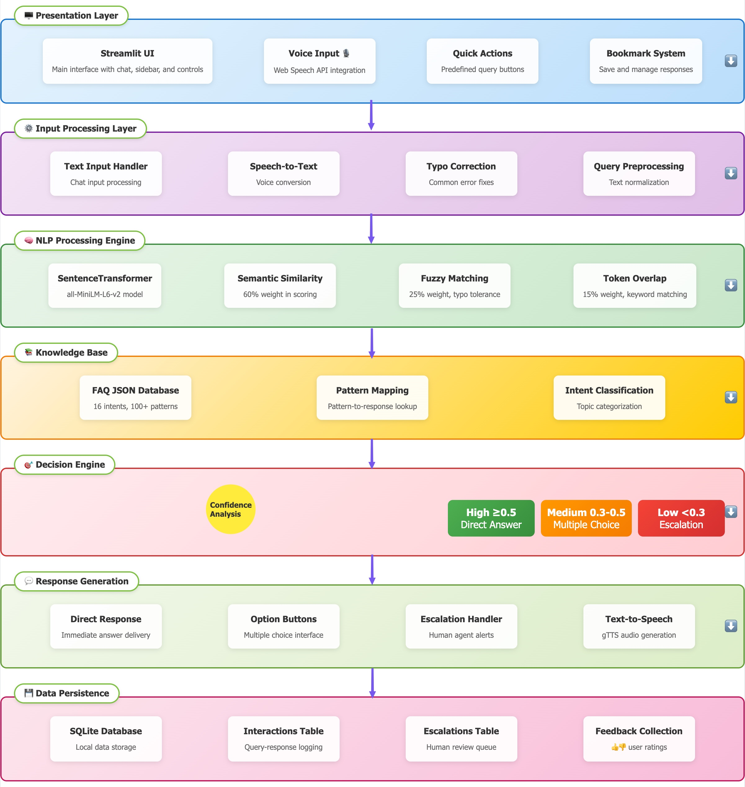
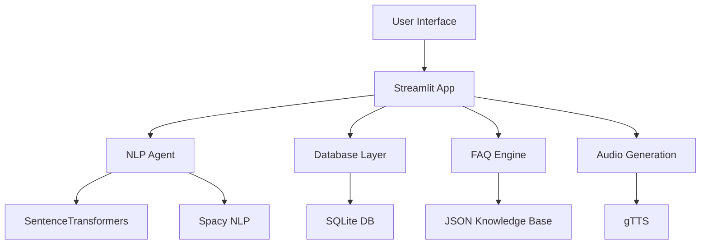
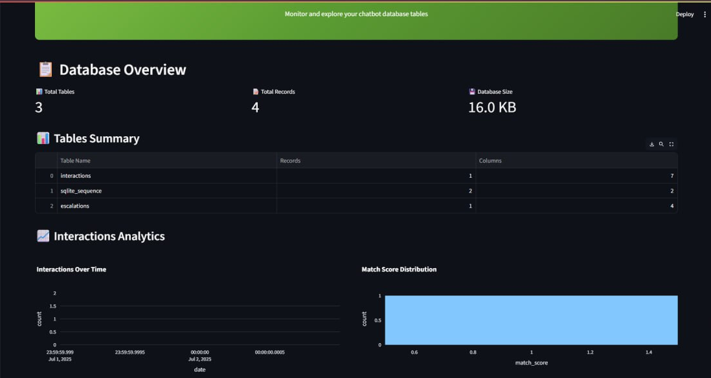
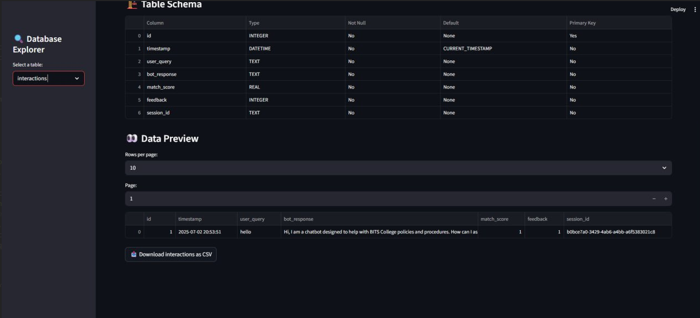
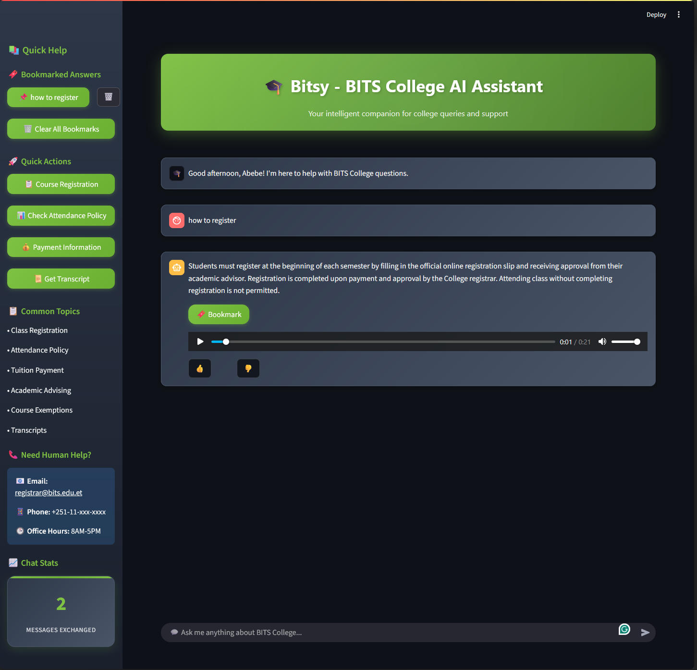

# 🎓 Bitsy - BITS College AI Assistant

<div align="center">


**An intelligent AI-powered chatbot designed specifically for BITS College students and staff**

_Providing instant answers to college-related queries with advanced NLP capabilities_

</div>

---

## 📋 Table of Contents

- [🌟 Features](#-features)
- [🏗️ Architecture](#️-architecture)
- [🚀 Quick Start](#-quick-start)
- [🛠️ Installation](#️-installation)
- [📊 Dashboard](#-dashboard)
- [🔧 Configuration](#-configuration)
- [📱 Usage Guide](#-usage-guide)
- [🧠 AI Capabilities](#-ai-capabilities)
- [📂 Project Structure](#-project-structure)
- [🔄 API Reference](#-api-reference)
- [🐛 Troubleshooting](#-troubleshooting)
- [🤝 Contributing](#-contributing)
- [📚 Additional Documentation](#-additional-documentation)
- [📄 License](#-license)

---

## 🌟 Features

### 🎯 Core Functionality

- **Intelligent Question Answering**: Advanced NLP-powered responses to college-related queries
- **Typo Tolerance**: Automatically corrects common spelling mistakes and typos
- **Multi-Modal Responses**: Text and audio responses for accessibility
- **Smart Suggestions**: Provides related questions when uncertain about user intent
- **Conversation History**: Maintains chat history with bookmark functionality

### 🔍 Advanced AI Capabilities

- **Semantic Understanding**: Uses SentenceTransformers for deep text comprehension
- **Fuzzy Matching**: Handles variations in user queries effectively
- **Context Awareness**: Understands educational domain-specific terminology
- **Escalation System**: Routes complex queries to human agents when needed

### 📊 Analytics & Monitoring

- **Real-time Dashboard**: Monitor chatbot performance and usage statistics
- **Interaction Logging**: Track all user interactions for continuous improvement
- **Feedback Collection**: User satisfaction tracking with thumbs up/down
- **Performance Metrics**: Match scores and response accuracy analytics

### 🎨 User Experience

- **Modern UI**: Beautiful, responsive interface with dark/light mode support
- **Mobile-Friendly**: Optimized for all device sizes
- **Accessibility**: Screen reader support and keyboard navigation
- **Personalization**: User name recognition and personalized greetings

---

## 🏗️ Architecture



### Core Components



### Technology Stack

| Component               | Technology           | Purpose                               |
| ----------------------- | -------------------- | ------------------------------------- |
| **Frontend**            | Streamlit            | Interactive web interface             |
| **NLP Engine**          | SentenceTransformers | Semantic text understanding           |
| **Language Processing** | Spacy                | Text preprocessing and tokenization   |
| **Database**            | SQLite               | Interaction logging and analytics     |
| **Audio**               | gTTS                 | Text-to-speech functionality          |
| **Containerization**    | Docker               | Deployment and scaling                |
| **Analytics**           | Plotly               | Interactive charts and visualizations |

---

## 🚀 Quick Start

### Prerequisites

- 🐳 **Docker** (recommended)
- 🐍 **Python 3.10+** (for local development)
- 💾 **2GB RAM minimum**
- 🌐 **Internet connection** (for model downloads)

### One-Command Setup

```bash
# Clone and run with Docker Compose
git clone <repository-url>
cd ai-chatbot
docker-compose up --build
```

**🎉 That's it! Access your chatbot at [http://localhost:8501](http://localhost:8501)**

---

## 🛠️ Installation

### Option 1: Docker Compose (Recommended)

```bash
# 1. Clone the repository
git clone <repository-url>
cd ai-chatbot

# 2. Build and run both applications
docker-compose up --build

# 3. Access the applications
# Chatbot: http://localhost:8501
# Dashboard: http://localhost:8502
```

### Option 2: Local Development

```bash
# 1. Create virtual environment
python -m venv venv
source venv/bin/activate  # On Windows: venv\Scripts\activate

# 2. Install dependencies
pip install -r requirements.txt

# 3. Download Spacy model
python -m spacy download en_core_web_md

# 4. Run the chatbot
streamlit run src/app.py

# 5. Run the dashboard (in another terminal)
streamlit run src/dashboard.py --server.port=8502
```

### Option 3: Docker Engine Only

```bash
# Build the image
docker build -t ai-chatbot .

# Run the chatbot
docker run -p 8501:8501 ai-chatbot

# Run the dashboard
docker run -p 8502:8502 ai-chatbot streamlit run src/dashboard.py --server.port=8502 --server.address=0.0.0.0
```

---

## 📊 Dashboard

The analytics dashboard provides comprehensive insights into chatbot performance and user interactions.

### Dashboard Features

#### 📈 Analytics Overview

- **Real-time Metrics**: Live interaction counts and performance stats
- **Usage Trends**: Daily/weekly usage patterns
- **Response Quality**: Match score distributions and accuracy metrics


_Analytics charts and graphs_

#### 🗄️ Database Explorer

- **Table Management**: Browse and export all database tables
- **Data Visualization**: Interactive charts for data exploration
- **Query Interface**: Direct database query capabilities


_Database explorer interface_

#### 🚨 Escalation Monitoring

- **Unresolved Queries**: Track questions that needed human intervention
- **Knowledge Gaps**: Identify areas for FAQ expansion
- **Response Optimization**: Suggestions for improving bot responses

### Accessing the Dashboard

```bash
# With Docker Compose
docker-compose up

# Navigate to http://localhost:8502
```

---

## 🔧 Configuration

### FAQ Customization

Edit `data/faq.json` to customize responses:

```json
{
  "intent": "registration",
  "patterns": [
    "How do I register for classes?",
    "Course registration process",
    "Class enrollment"
  ],
  "response": "To register for classes, please visit the student portal..."
}
```

---

## 📱 Usage Guide

### For Students

#### 🔍 Asking Questions


_Main chat interface with user asking a question_

1. **Type your question** in natural language
2. **Get instant answers** with high accuracy
3. **Use voice output** for accessibility
4. **Bookmark important** answers for later reference

#### 💡 Tips for Better Results

- Use specific keywords related to your query
- Don't worry about typos - the bot handles them automatically
- Try rephrasing if the first answer isn't what you're looking for
- Use the suggested quick actions for common queries

### For Administrators

#### 📊 Monitoring Performance

1. **Access the dashboard** at `http://localhost:8502`
2. **Monitor user interactions** and satisfaction rates
3. **Identify knowledge gaps** from escalated queries
4. **Export data** for further analysis

#### 🛠️ Content Management

1. **Update FAQ responses** in `data/faq.json`
2. **Add new intents** and patterns as needed
3. **Monitor escalations** to identify missing content
4. **Restart the application** to load new content

---

## 🧠 AI Capabilities

### Natural Language Processing

The chatbot uses advanced NLP techniques for understanding user queries:

#### 🎯 Semantic Understanding

- **SentenceTransformers**: Deep semantic comprehension
- **Context Awareness**: Understanding of educational terminology
- **Intent Recognition**: Accurate classification of user requests

#### 🔤 Text Processing

- **Typo Correction**: Automatic fixing of common misspellings
- **Lemmatization**: Root word extraction for better matching
- **Stop Word Filtering**: Focus on meaningful content

#### 📊 Similarity Scoring

```python
# Weighted combination of multiple similarity measures
final_score = (
    semantic_score * 0.6 +    # Primary: semantic understanding
    fuzzy_score * 0.25 +      # Secondary: typo tolerance
    overlap_score * 0.15      # Tertiary: keyword overlap
)
```

### Model Performance

| Metric             | Value | Description                         |
| ------------------ | ----- | ----------------------------------- |
| **Accuracy**       | 85%+  | Correct responses for known queries |
| **Coverage**       | 90%+  | Queries handled without escalation  |
| **Response Time**  | <2s   | Average time to generate response   |
| **Typo Tolerance** | 95%+  | Handling of common misspellings     |

---

## 📂 Project Structure

```
ai-chatbot/
├── 📁 src/                     # Source code
│   ├── 🐍 app.py              # Main Streamlit application
│   ├── 🤖 chatbot.py          # Core chatbot logic
│   ├── 🧠 nlp_agent.py        # NLP processing engine
│   ├── 🗄️ database.py         # Database operations
│   └── 📊 dashboard.py        # Analytics dashboard
├── 📁 data/                   # Data files
│   ├── 📋 faq.json            # Knowledge base
│   └── 🗄️ chatbot.db          # SQLite database
├── 📁 docs/                   # Documentation
├── 📁 test/                   # Test files
├── 🐳 Dockerfile             # Container configuration
├── 🔧 docker-compose.yml     # Multi-service setup
├── 📦 requirements.txt       # Python dependencies
└── 📖 README.md              # This file
```

### Key Files Description

| File           | Purpose    | Key Functions                              |
| -------------- | ---------- | ------------------------------------------ |
| `app.py`       | Main UI    | Chat interface, user interactions          |
| `nlp_agent.py` | NLP Engine | Text processing, similarity matching       |
| `chatbot.py`   | Core Logic | FAQ loading, answer retrieval              |
| `database.py`  | Data Layer | Logging, analytics data storage            |
| `dashboard.py` | Analytics  | Performance monitoring, data visualization |

---

## 🔄 API Reference

### Core Functions

#### NLP Agent (`nlp_agent.py`)

```python
def get_best_match(user_query, questions, threshold=0.45):
    """
    Find the best matching question for a user query.

    Args:
        user_query (str): User's input question
        questions (list): List of possible questions
        threshold (float): Minimum similarity score

    Returns:
        tuple: (best_question, similarity_score)
    """
```

#### Database Operations (`database.py`)

```python
def log_interaction(session_id, query, response, score):
    """
    Log a user interaction to the database.

    Args:
        session_id (str): Unique session identifier
        query (str): User's question
        response (str): Bot's response
        score (float): Confidence score

    Returns:
        int: Interaction ID
    """
```

### Configuration Options

| Parameter         | Default | Description                               |
| ----------------- | ------- | ----------------------------------------- |
| `MATCH_THRESHOLD` | 0.45    | Minimum similarity for confident response |
| `SEMANTIC_WEIGHT` | 0.6     | Weight for semantic similarity            |
| `FUZZY_WEIGHT`    | 0.25    | Weight for fuzzy string matching          |
| `OVERLAP_WEIGHT`  | 0.15    | Weight for token overlap                  |

---

## 🐛 Troubleshooting

### Common Issues

#### 🚫 Model Download Errors

**Problem**: SentenceTransformers model fails to download

**Solution**:

```bash
# Manually download the model
python -c "from sentence_transformers import SentenceTransformer; SentenceTransformer('all-MiniLM-L6-v2')"
```

#### 🗄️ Database Connection Issues

**Problem**: SQLite database locked or corrupted

**Solution**:

```bash
# Remove the database file (will be recreated)
rm data/chatbot.db
# Restart the application
docker-compose restart
```

#### 🐳 Docker Build Failures

**Problem**: Docker build fails due to dependency issues

**Solution**:

```bash
# Clean build without cache
docker-compose build --no-cache
# Or try building individual services
docker-compose build app
```

### Performance Optimization

#### 🚀 Improving Response Times

1. **Enable model caching**: Ensure `@st.cache_resource` is working
2. **Optimize FAQ size**: Remove duplicate or similar patterns
3. **Adjust similarity weights**: Fine-tune for your use case

#### 💾 Memory Management

```python
# Monitor memory usage
docker stats ai-chatbot

# Optimize Docker memory
docker-compose up --memory=2g
```

### Logging and Debugging

Enable debug mode for detailed logging:

```python
# Add to app.py
import logging
logging.basicConfig(level=logging.DEBUG)
```

---

## 🤝 Contributing

We welcome contributions! Here's how to get started:

### Development Setup

```bash
# 1. Fork the repository
git clone <your-fork-url>
cd ai-chatbot

# 2. Create development branch
git checkout -b feature/your-feature-name

# 3. Set up development environment
python -m venv venv
source venv/bin/activate
pip install -r requirements.txt
pip install -r requirements-dev.txt  # Development dependencies

# 4. Run tests
python -m pytest test/

# 5. Start development server
streamlit run src/app.py
```

### Contribution Guidelines

#### 🔧 Code Standards

- Follow PEP 8 style guidelines
- Add docstrings to all functions
- Include type hints where appropriate
- Write tests for new features

#### 📝 Pull Request Process

1. **Update documentation** for any new features
2. **Add tests** for bug fixes and new functionality
3. **Ensure all tests pass** before submitting
4. **Update README** if needed

#### 🐛 Bug Reports

Please include:

- Clear description of the issue
- Steps to reproduce
- Expected vs actual behavior
- Environment details (OS, Python version, etc.)

### Feature Requests

We're always looking to improve! Consider contributing:

- 🌍 **Multi-language support**
- 🔗 **API integrations** (Canvas, student portals)
- 🎨 **UI/UX improvements**
- 🧠 **Advanced NLP features**
- 📊 **Enhanced analytics**

---

## 📄 License

This project is licensed under the MIT License - see the [LICENSE](LICENSE) file for details.

```
MIT License

Copyright (c) 2024 BITS College AI Assistant

Permission is hereby granted, free of charge, to any person obtaining a copy
of this software and associated documentation files (the "Software"), to deal
in the Software without restriction, including without limitation the rights
to use, copy, modify, merge, publish, distribute, sublicense, and/or sell
copies of the Software, and to permit persons to whom the Software is
furnished to do so, subject to the following conditions:

The above copyright notice and this permission notice shall be included in all
copies or substantial portions of the Software.
```

---

## 🙏 Acknowledgments

- **SentenceTransformers** team for the amazing semantic understanding models
- **Streamlit** for the incredible web framework
- **Spacy** for robust NLP capabilities
- **BITS College** for the inspiration and use case

---

<div align="center">

**Made with ❤️ for BITS College**

⭐ **Star this repo** if you found it helpful!

</div>
