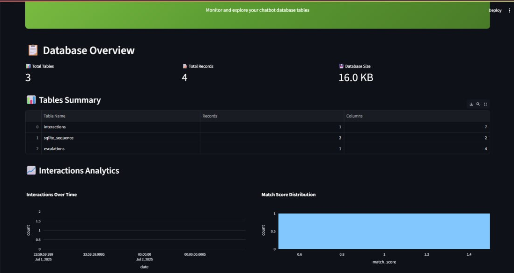
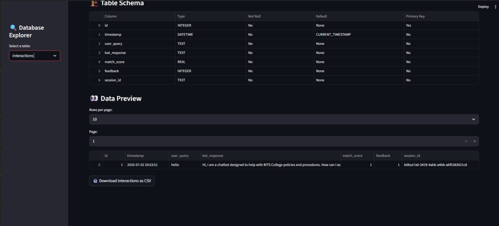

# 📊 Dashboard User Guide

## Overview

The Analytics Dashboard provides comprehensive insights into your chatbot's performance and user interactions. This guide will help you navigate and utilize all dashboard features effectively.

## Accessing the Dashboard

### With Docker Compose

```bash
docker-compose up
# Navigate to http://localhost:8502
```

### Standalone

```bash
streamlit run src/dashboard.py --server.port=8502
```

## Dashboard Sections

### 1. Database Overview



The overview section provides:

- **Total Tables**: Number of database tables
- **Total Records**: Combined record count across all tables
- **Database Size**: Current database file size

### 2. Table Explorer



Features:

- **Table Selection**: Dropdown to choose specific tables
- **Schema Information**: Column types, constraints, and relationships
- **Data Preview**: Paginated view of table contents
- **Export Functionality**: Download tables as CSV

### 3. Interactions Analytics

Key Metrics:

- **Usage Trends**: Daily/weekly interaction patterns
- **Response Quality**: Distribution of match scores
- **User Satisfaction**: Feedback ratings over time

### 4. Performance Monitoring

Monitor:

- **Response Times**: Average query processing time
- **Success Rates**: Percentage of successful responses
- **Escalation Rates**: Queries requiring human intervention

## Using the Dashboard

### Filtering Data

1. **Date Range**: Select time periods for analysis
2. **User Sessions**: Filter by specific user sessions
3. **Response Types**: Filter by successful vs escalated queries

### Exporting Reports

1. Click "Export" button in any section
2. Choose format (CSV, JSON, Excel)
3. Select date range
4. Download generated report

### Real-time Updates

The dashboard automatically refreshes data every 30 seconds when viewing live metrics.

## Troubleshooting

### Dashboard Won't Load

- Check if port 8502 is available
- Verify database connection
- Ensure dashboard.py has no syntax errors

### Missing Data

- Confirm chatbot is logging interactions
- Check database file permissions
- Verify table structure matches expected schema

### Performance Issues

- Limit date ranges for large datasets
- Use pagination for table views
- Consider database optimization for large volumes
