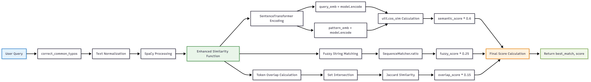
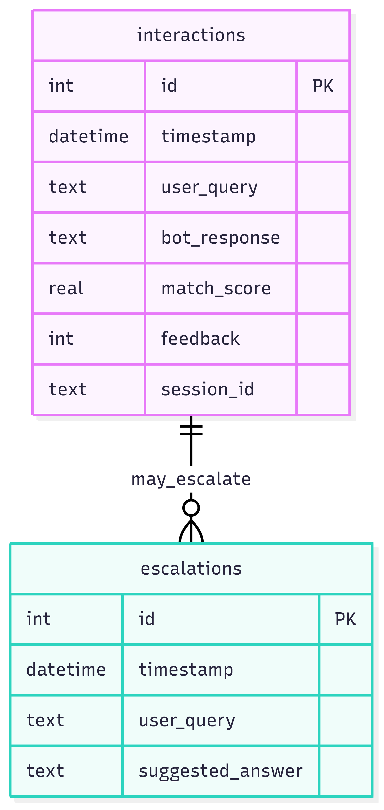

# 🛠️ Developer Guide

## Development Environment Setup

### Prerequisites

- Python 3.10+
- Git
- VS Code (recommended) or your preferred IDE
- Docker (for testing containerized deployment)

### Local Development Setup

```bash
# 1. Clone and navigate
git clone <repository-url>
cd ai-chatbot

# 2. Create virtual environment
python -m venv venv
source venv/bin/activate  # On Windows: venv\Scripts\activate

# 3. Install dependencies
pip install -r requirements.txt
pip install -r requirements-dev.txt

# 4. Download required models
python -m spacy download en_core_web_md

# 5. Set up pre-commit hooks (optional but recommended)
pre-commit install
```

### Project Structure Deep Dive

```
ai-chatbot/
├── src/
│   ├── app.py              # Main Streamlit application
│   ├── chatbot.py          # Core chatbot logic
│   ├── nlp_agent.py        # NLP processing engine
│   ├── database.py         # Database operations
│   └── dashboard.py        # Analytics dashboard
├── data/
│   ├── faq.json           # Knowledge base (modify this!)
│   └── chatbot.db         # SQLite database (auto-generated)
├── docs/                  # Documentation files
├── test/                  # Test files
├── requirements.txt       # Production dependencies
├── requirements-dev.txt   # Development dependencies
├── Dockerfile            # Container configuration
└── docker-compose.yml    # Multi-service setup
```

## Core Components

### 1. NLP Agent (`nlp_agent.py`)


_Diagram showing NLP processing_

The heart of the chatbot's intelligence:

```python
def enhanced_similarity(query, pattern):
    """
    Combines multiple similarity measures:
    - Semantic similarity (60% weight)
    - Fuzzy string matching (25% weight)
    - Token overlap (15% weight)
    """
```

Key functions:

- `get_best_match()`: Find most similar FAQ entry
- `correct_common_typos()`: Fix spelling mistakes
- `enhanced_similarity()`: Multi-factor similarity scoring

### 2. Database Layer (`database.py`)


_Database schema diagram_

Handles all data persistence:

```sql
-- Interactions table
CREATE TABLE interactions (
    id INTEGER PRIMARY KEY,
    timestamp DATETIME,
    user_query TEXT,
    bot_response TEXT,
    match_score REAL,
    feedback INTEGER,
    session_id TEXT
);

-- Escalations table
CREATE TABLE escalations (
    id INTEGER PRIMARY KEY,
    timestamp DATETIME,
    user_query TEXT,
    suggested_answer TEXT
);
```

### 3. FAQ Engine (`chatbot.py`)

Simple but effective knowledge base:

```json
{
  "intent": "example",
  "patterns": ["question variant 1", "question variant 2"],
  "response": "The answer to provide"
}
```

## Development Workflow

### 1. Adding New Features

```bash
# Create feature branch
git checkout -b feature/new-feature

# Make changes
# ... code changes ...

# Test changes
python -m pytest test/

# Commit and push
git add .
git commit -m "Add new feature"
git push origin feature/new-feature
```

### 2. Testing

```bash
# Run all tests
python -m pytest test/

# Run with coverage
python -m pytest --cov=src test/

# Run specific test file
python -m pytest test/test_nlp_agent.py -v
```

## Customization Guide

### 1. Modifying the FAQ

![FAQ Customization - Add Screenshot Here]
_Screenshot Placeholder: FAQ editor or JSON structure_

Edit `data/faq.json` to add your institution's information:

```json
{
  "intent": "custom_policy",
  "patterns": [
    "What is the makeup exam policy?",
    "Can I retake an exam?",
    "Makeup test procedures"
  ],
  "response": "Makeup exams are available for students who miss scheduled exams due to documented emergencies. Contact your instructor within 48 hours."
}
```

### 2. Adjusting NLP Parameters

![NLP Configuration - Add Screenshot Here]
_Screenshot Placeholder: Configuration file or parameter tuning interface_

In `nlp_agent.py`, modify these constants:

```python
# Similarity score thresholds
MATCH_THRESHOLD = 0.45  # Minimum confidence for responses
SEMANTIC_WEIGHT = 0.6   # Weight for semantic similarity
FUZZY_WEIGHT = 0.25     # Weight for fuzzy matching
OVERLAP_WEIGHT = 0.15   # Weight for token overlap
```

### 3. UI Customization

![UI Customization - Add Screenshot Here]
_Screenshot Placeholder: CSS customization interface_

Modify the CSS in `app.py` to match your institution's branding:

```python
# Change brand color
BRAND_COLOR = "#7EC143"  # Your institution's color

# Update institution name
COLLEGE_NAME = "Your College Name"
```

## Performance Optimization

### 1. Model Caching

Ensure models are properly cached:

```python
@st.cache_resource
def load_sentence_transformer():
    return SentenceTransformer('all-MiniLM-L6-v2')
```

### 2. Database Optimization

```sql
-- Add indexes for better query performance
CREATE INDEX idx_interactions_timestamp ON interactions(timestamp);
CREATE INDEX idx_interactions_session ON interactions(session_id);
```

### 3. FAQ Optimization

- Remove duplicate patterns
- Group similar intents
- Use clear, distinct language in patterns

## Debugging

### 1. Enable Debug Logging

```python
import logging
logging.basicConfig(level=logging.DEBUG)
```

### 2. Common Issues

**Model Loading Errors**:

```bash
# Manually download models
python -c "from sentence_transformers import SentenceTransformer; SentenceTransformer('all-MiniLM-L6-v2')"
```

**Database Lock Issues**:

```bash
# Check database file permissions
ls -la data/chatbot.db

# Reset database if corrupted
rm data/chatbot.db
# Restart application to recreate
```

## Deployment

### 1. Production Considerations

- Use environment variables for configuration
- Set up proper logging
- Configure reverse proxy (nginx)
- Enable HTTPS
- Set up monitoring and alerts

### 2. Docker Production Build

```dockerfile
# Multi-stage build for smaller production image
FROM python:3.10-slim as builder
# ... build steps ...

FROM python:3.10-slim as production
# ... production configuration ...
```

### 3. Environment Variables

```bash
# Production environment
export STREAMLIT_SERVER_PORT=8501
export STREAMLIT_SERVER_ADDRESS=0.0.0.0
export DATABASE_URL=sqlite:///data/chatbot.db
```

## Contributing

### Code Standards

1. **PEP 8**: Follow Python style guidelines
2. **Docstrings**: Document all functions
3. **Type Hints**: Use type annotations
4. **Tests**: Write tests for new features

### Pull Request Checklist

- [ ] Code follows style guidelines
- [ ] Tests pass
- [ ] Documentation updated
- [ ] CHANGELOG.md updated
- [ ] No breaking changes (or properly documented)

## Advanced Features

### 1. Adding New NLP Models

```python
# Example: Adding BERT for better semantic understanding
from transformers import BertModel, BertTokenizer

@st.cache_resource
def load_bert_model():
    return BertModel.from_pretrained('bert-base-uncased')
```

### 2. Custom Analytics

Add custom metrics to the dashboard:

```python
def calculate_user_satisfaction():
    # Custom satisfaction metric
    positive_feedback = get_positive_feedback_count()
    total_interactions = get_total_interactions()
    return positive_feedback / total_interactions
```
