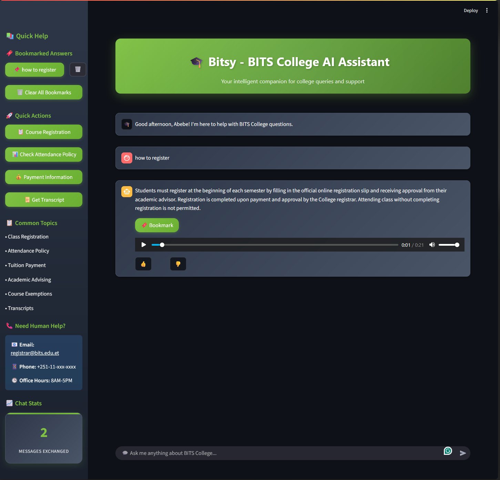

# 🚀 Quick Start Guide

## Getting Started in 5 Minutes

This guide will get you up and running with Bitsy in under 5 minutes.

### Step 1: Prerequisites Check

Ensure you have Docker installed:

```bash
docker --version
# Should output: Docker version 20.x.x or higher
```

### Step 2: Clone and Setup

```bash
# Clone the repository
git clone <repository-url>
cd ai-chatbot

# Start the application
docker-compose up --build
```

### Step 3: Access the Applications

Once the build completes, open these URLs:

- **Chatbot**: [http://localhost:8501](http://localhost:8501)
- **Dashboard**: [http://localhost:8502](http://localhost:8502)



### Step 4: First Interaction

1. Enter your name when prompted
2. Ask a question like "How do I register for classes?"
3. See the AI respond with relevant information

### Step 5: Explore Features

Try these features:

- Use quick action buttons in sidebar
- Bookmark useful responses
- Listen to audio responses
- Check the dashboard for analytics

## Common First Questions

Here are some questions you can try:

### Academic Queries

- "What is the attendance policy?"
- "How do I register for classes?"
- "Can I repeat a course?"

### Administrative Queries

- "How do I pay tuition fees?"
- "Where do I get my transcript?"
- "Who is my academic advisor?"

### General Information

- "What are the office hours?"
- "How do I contact the registrar?"
- "What is the grading system?"

## Next Steps

After your first successful interaction:

1. **Customize FAQ**: Edit `data/faq.json` to add your institution's specific information
2. **Monitor Usage**: Check the dashboard to see interaction patterns
3. **Configure Settings**: Adjust similarity thresholds in the code
4. **Add Content**: Expand the knowledge base based on user escalations

## Troubleshooting Quick Start

### Port Already in Use

```bash
# Check what's using the ports
lsof -i :8501
lsof -i :8502

# Stop the processes or use different ports
docker-compose down
```

### Build Failures

```bash
# Clean build
docker-compose build --no-cache

# Check logs
docker-compose logs
```

### Application Not Loading

1. Wait 2-3 minutes for models to download
2. Check Docker container status: `docker ps`
3. View logs: `docker-compose logs app`

## Success Indicators

You'll know everything is working when:

✅ Docker containers are running  
✅ Chatbot loads at localhost:8501  
✅ Dashboard loads at localhost:8502  
✅ Bot responds to test questions  
✅ Audio playback works  
✅ Dashboard shows interaction data
